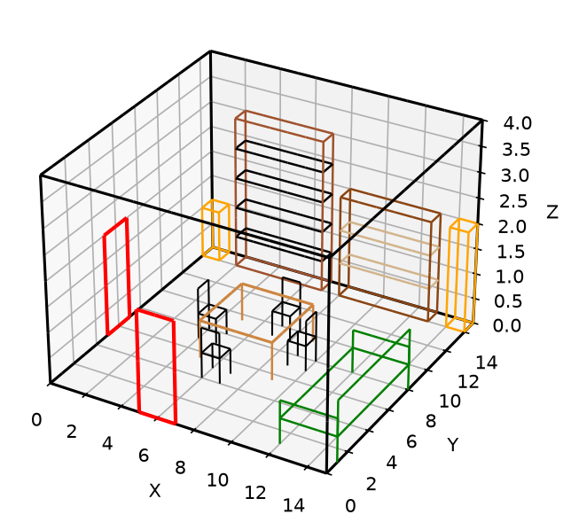
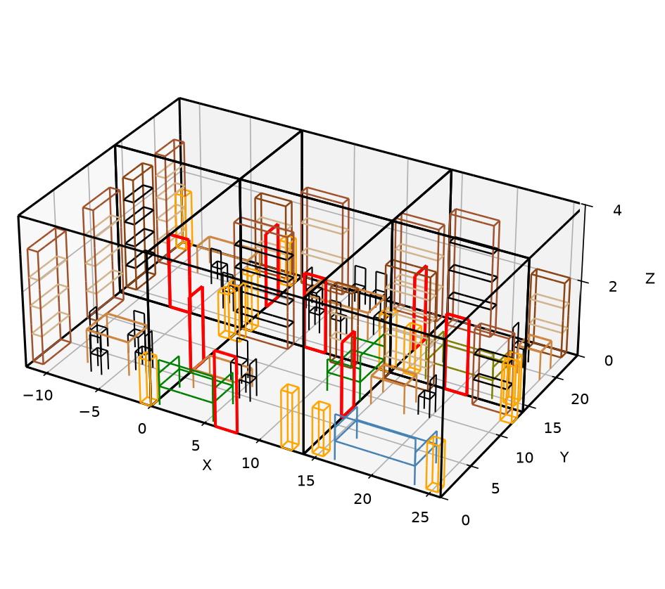

# Virtual Room Builder

Compose and render 3D wireframe rooms and floorplans with matplotlib.



## Install

Requires Python 3.10+.

```bash
pip install -e ".[dev]"
```

## Usage

```bash
virtual-room-builder
```

Opens an interactive matplotlib window with the example room. Show the
bundled six-room floorplan:

```bash
virtual-room-builder --example floorplan
```

Write an image instead of opening a window:

```bash
virtual-room-builder --output room.png
virtual-room-builder --example floorplan --output floorplan.png
```

Use as a library:

```python
from virtual_room_builder import Room, Scene, Chair, Table, Direction

scene = Scene(room=Room(length=12, width=10, height=3))
scene.add(Chair(x=3, y=3, direction=Direction.NORTH, color="black"))
scene.add(Table(x=2, y=2, length=3, width=3, top_height=0.75, color="peru"))

fig = scene.figure()  # validates containment first, then renders
fig.savefig("room.png")
```

Furniture pieces are dataclasses: `Chair`, `Table`, `Lamp`, `Bookshelf`,
`Couch`. Each takes an `x`, `y` anchor (the local origin corner) and a
`Direction` (`NORTH`, `SOUTH`, `EAST`, `WEST`). Chair, table, lamp, and couch
rotate about that anchor. Bookshelf uses facing-dependent extents:
north/south run length along x, east/west along y, with depth toward the
facing side.

`Door` takes an `orientation` of `"horizontal"` or `"vertical"`. Horizontal
doors must sit on the south (y=0) or north wall; vertical doors must sit on
the west (x=0) or east wall. Optional `name` is the id `FloorPlan.connect`
looks up.

`Scene.figure()` and `Scene.validate()` check room containment for furniture
and wall attachment for doors. They do not detect furniture-to-furniture
overlap. `Scene.render(ax)` draws without validating. Wireframe edges are
matplotlib `Line3DCollection`s, split along their length. Draw order uses the
farther XY endpoint of each piece.

Join rooms at named opposite-wall doors with `FloorPlan`. The first room added
sits at world `(0, 0)`. Each `connect` aligns those doorways. All rooms must
be reachable from the first room. Interiors must not overlap.

```python
from virtual_room_builder import Door, FloorPlan, Room, Scene

living = Scene(room=Room(length=15, width=12, height=4))
living.add_door(Door(x=15, y=4, height=2, width=2, orientation="vertical", name="to_kitchen"))

kitchen = Scene(room=Room(length=10, width=12, height=4))
kitchen.add_door(Door(x=0, y=4, height=2, width=2, orientation="vertical", name="to_living"))

plan = FloorPlan()
plan.add("living", living)
plan.add("kitchen", kitchen)
plan.connect("living", "to_kitchen", "kitchen", "to_living")
fig = plan.figure()
```

East joins west, and north joins south. Door width and height must match.
X and Y share a world unit. Z is drawn as tall as the first room's longer
floor side, the same cubic-box ratio `Scene.figure` uses for a single room.



## Project layout

- `src/virtual_room_builder/geometry.py` - shared rotation and box math
- `src/virtual_room_builder/draw.py` - 3D line collections, long edges split, depth from the farther XY endpoint
- `src/virtual_room_builder/room.py` - the room shell
- `src/virtual_room_builder/door.py` - doorway markers, optional name for FloorPlan.connect
- `src/virtual_room_builder/furniture/` - chair, table, lamp, bookshelf, couch
- `src/virtual_room_builder/scene.py` - composes a room with its furniture, validates fit
- `src/virtual_room_builder/floorplan.py` - joins scenes at named shared doors
- `src/virtual_room_builder/cli.py` - command-line entry, `--example room` or `floorplan`
- `src/virtual_room_builder/examples.py` - the default example scene and floorplan
- `tests/` - pytest suite covering geometry, furniture, scenes, doors, and floorplans

## Contributing

Pull requests are welcome. Open an issue first for larger changes. Run:

```bash
pytest
ruff check src tests
mypy src
```

## License

MIT © 2026 Cody Marsengill. See [LICENSE](LICENSE).
